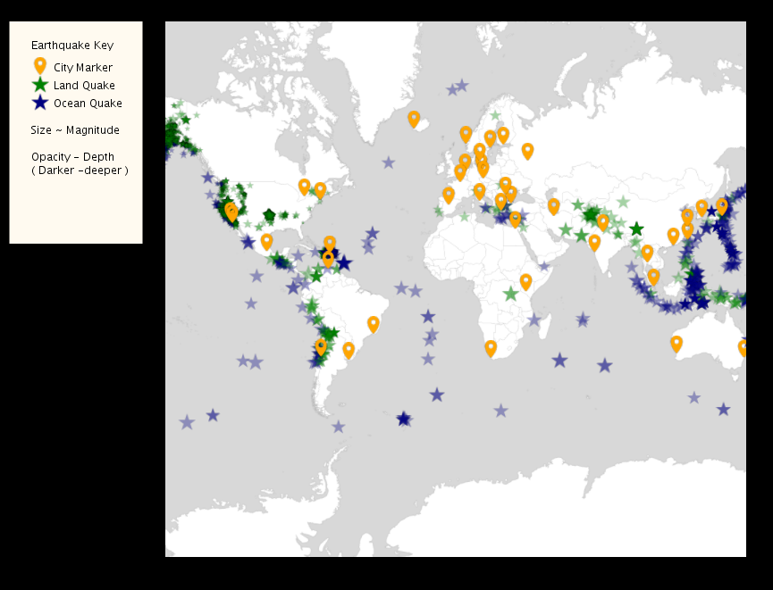
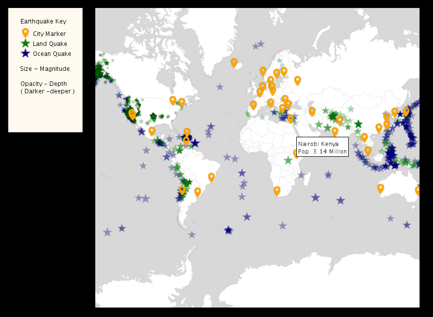
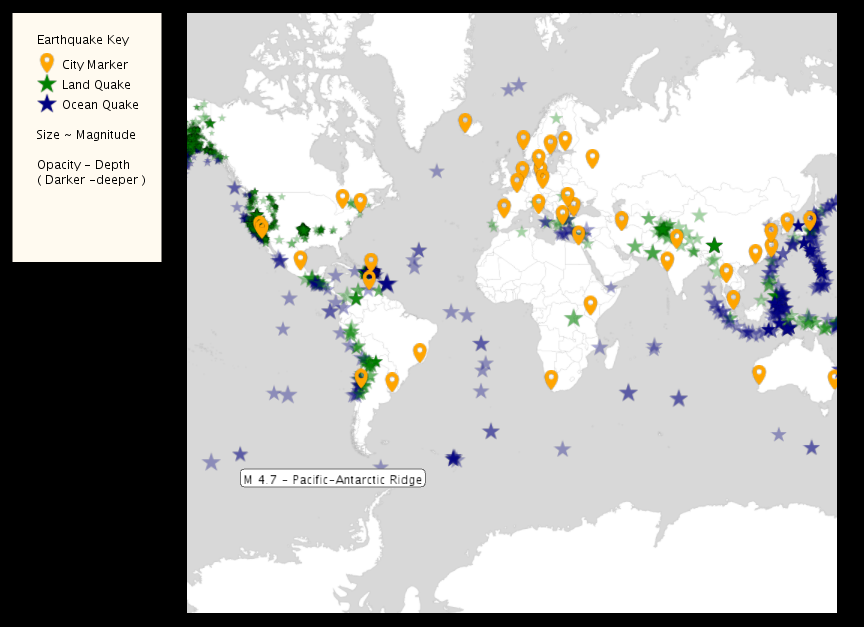
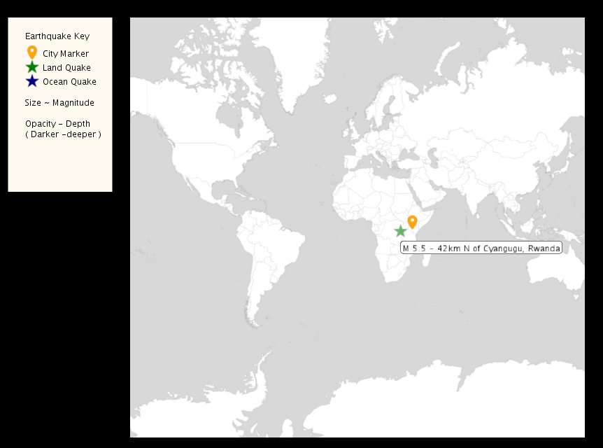

<html>
    <head>
      <meta charset="UTF-8">
      <link rel="stylesheet" type="text/css" href="style.css">
   <title>Johanna Lyytinen, harjoitustyön raportti</title>
  </head>
<body>

<h1>Coursera - Object Oriented Programming with Java</h1>
<h2>Johanna Lyytinen</h2>
<h2>Harjoitustyö</h2>

1.6.2020

Harjoitustyön koodit on nähtävissä Githubissa osoitteessa: <a href="https://github.com/johannaly/coursera_objectOrientedJava">https://github.com/johannaly/coursera_objectOrientedJava</a>

<h2>Kurssin yleiskuvaus</h2>

Kurssilla toteutetiin yksi isompi harjoitustyö, jota rakennettiin joka osion pääteeksi uusilla opituilla asioilla. Viimeiseen versioon
    tehtiin myös omavalintainen laajennus tai muutos. Tämä lopullinen versio oman muutoksen toteutuksen jälkeen myös arvioitiin toisten opiskelijoiden toimesta.
    Kurssiin sisältyi harjoitustöiden lisäksi myös monivalintakokeita jokaisen osion lopuksi ja osittain myös välillä tehtiin pieniä monivalintatestejä, 
    joilla pystyi itse tarkkailemaan oliko ymmärtänyt asian.
    

<h2>Lopullisen harjoitustyön kuvaus</h2>

Lopullisessa harjoitustyössä mallinnetaan maanjäristyksiä kartalla. Kartalla näkyvät myös maiden pääkaupungit.
    Kartan vieressä on käyttäjälle selitteet eri ikoneista ja niiden merkityksistä.  

    

        
    

    

Kun käyttäjä vie hiiren ikonin päälle,
    ilmestyy lisätietoruutu, joka kertoo tietoa kyseisestä kaupungista tai maanjäristyksestä. Alla kuva näistä molemmista vaihtoehdoista. 

    

        
    

    

        
    

Maanjäristysikonia klikattaessa näkyviin jää kaupunki / kaupungit, 
    jotka kuuluvat kyseisen maanjäristyksen vaikutuspiiriin (threath circle). Jos klikataan kaupunki-ikonia, jäävät ne maanjäristykset näkyviin,
    jotka saattavat vaikuttaa kyseiseen kaupunkiin. Alla esimerkkikuva tästä tilanteesta. Kun karttaa tai ikonia klikataan uudelleen, tulevat
    kaikki ikonit kartalle jälleen näkyviin.

    

Itse päätin lähteä laajentamaan työtä muuttamalla kartalla näkyvät ikonit visuaalisesti miellyttävimpiin. Alunperin ikonit oli piirrettyjä kolmioita
    ja ympyröitä. Otin avuksi PImage -luokan prosessing.coresta ja muutin koodia myös niin, että järistyksen syvyys näkyy värin läpinäkyvyytenä. järistyksen
    suuruus ilmaistaan ikonin koolla. Muutin myös näiltä osin kartan vieressä olevaa käyttäjän opastusta. Nämä muutokset ovat jo siis näkyvissä esitetyissä 
    kuvakaappauksissa.

<h2>Itsearvio kurssista</h2>

Kurssi eteni aika vauhdilla, joten olin ihan tyytyväinen, että olin aiemmin käynyt Javan peruskurssin. Aivan perusrakenteisiin tällä kurssilla
    ei käytetty kovin paljon aikaa. Toisaalta esimerkiksi muistimalleja käytiin hyvinkin paljon läpi ja itse koin sen hyvin tarpeellisena. 
    Olin tyytyväinen siitä, että kurssilla tehtiin yksi laajempi harjoitustyö monen pienen sijaan. Tosin kurssin
    luennoilla tehtiin välillä myös pienempiä esimerkkiohjelmia. Ison työn etu on se, että koko kurssi nivoutuu sen ympärille ja ainakin omasta mielestäni
    työn tekeminen pysyy koko ajan mielenkiintoisena jatkuvuuden vuoksi. Samalla tulee myös kokemusta siitä, miten vähän isompia töitä voidaan toteuttaa, eikä
    oppiminen jää vain pelkkien pienten töiden varaan.

    
   
Kokonaisuutena pidin kurssista. Huonona puolena koin sen, että tukea ja apua oli melko rajallisesti saatavilla ja google olikin välillä
    kovassa käytössä. Kurssialueella on toki oma keskustelualue jokaiselle osiolla ja näissä voi keskustella ja kysellä kurssin aiheista. Näin laajalle 
    joukolle tarjottavissa kursseissa on toki mahdoton järjestää jokaiselle henkilökohtaista ohjausta.

   
Pidin kurssin edetessä päiväkirjaa kurssiin menevästä ajasta. Ensimmäiset osiot olivat suhteellisen nopeita, mutta mitä pidemmälle kurssissa 
        edettiin, sitä monimutkaisemmiksi tehtävät muuttuivat ja aikaakin alkoi kulumaan eri tavalla. Yhteensä kurssiin meni aikaa noin 50 tuntia. 
     

    
</body>
</html> 
